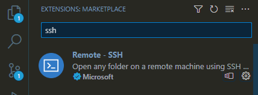
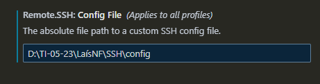

# Preparação de ambiente
### Vamos preparar o ambiente para desenvolvimento de aplicações.

#### Neste ambiente iremos instalar e configurar os seguintes recursos:
- Máquina Virtual(Virtualbox)
- Distribuição Linux (Ubuntu Server)
- Nasm
- Compilador da linguagem C
- Configurar o IP e a porta de comunicação entre a máquina real e a virtual
- Configurar o acesso via SSH entre o VSCode e o servidor Linux
- Instalar as extensões: Material, Icon, Nasm, SSH e Linguagem C/C++

#### Máquina Virtual (VirtualBox)


Máquina Virtual é uma ferramenta que permite a criação de novos "computadores" e a instalação de sistema operacionais para estudo ou trabalhio.

Para o nosso estudo iremos usar o VitualBox, da Oracle.
Para instalar, basta fazer o download no link a seguir:
<a href="https://www.virtualbox.org/wiki/Downloads" target="_blank">VirtualBox</a>

##### Criando a máquina virtual para o nosso estudo

- Configuração:
   > - Nome da máquina: Servidor
   > - Memória: 4GB(4096)
   > - Processador: 2
   > - Disco: 100GB
   > - IP e Porta do Host: 127.0.0.1 e 22
   > - IP e Porta do Convidado: 10.0.2.15 e 22

- Tela inicial de configuração


- Tela inicial de configuração do hardware


- Tela inicial de configuração do disco


- Tela final de configuração


- Tela inicial de configuração de rede


- Tela de configuração de Portas e IP


### Distribuição do Ubuntu Server


Para nosso estudo iremos utilizar uma distribuição Linux para servidores chamada Ubuntu.

Acompanhe o processo de instalação:

Faça o download aqui:<a href= "https://ubuntu.com/download/server" target="_blank"> Ubuntu Server</a>

- Acompanhe a instalação:

Tela de início de instalação


Tela de seleção de idioma


Tela de seleção de teclado


Tela de tipo de instalação


Tela de configuraçao de rede


Tela de configuração de proxy


Tela de pacotes de atualização


Tela de configuração de disco


Tela de layout do disco


Tela de configuração do usuário


Tela de configuração do SSH


Tela do fim da instalação


#### Atualização do sistema

Para a correta utilização do servidor Ubuntu que acabamos de instalar, será necessário realizar a atualização do sistema.

Execute o comando abaixo:

```
sudo apt update -y && sudo apt upgrade -y
```
Reinicie o seu servidor usando o comando abaixo:

```
reboot
```

#### Instalação do compilador NASM
O compilador do NASM é uma ferramenta que nos permite programar em Assembly. Assim, é possível criar programas que manipulam dados que estão nos registradores do processador.

Para instalar no NASM no Ubuntu, usamos o comando:

```
sudo apt install nasm -y
```

#### Instalador do compilador da Linguagem C

Em Linux, o compilador da linguagem C é o GCC. Ele é uma ferramente importante para o desenvolvimento de programas em C.

Para instalar use o comando:

```
sudo apt install gcc -y
```

#### Conexão Servidor e VSCode via SSH

Precisamos instalar uma extensão no VSCode para acessar nosso servidor de forma remota.



Configuração do acesso remoto.




